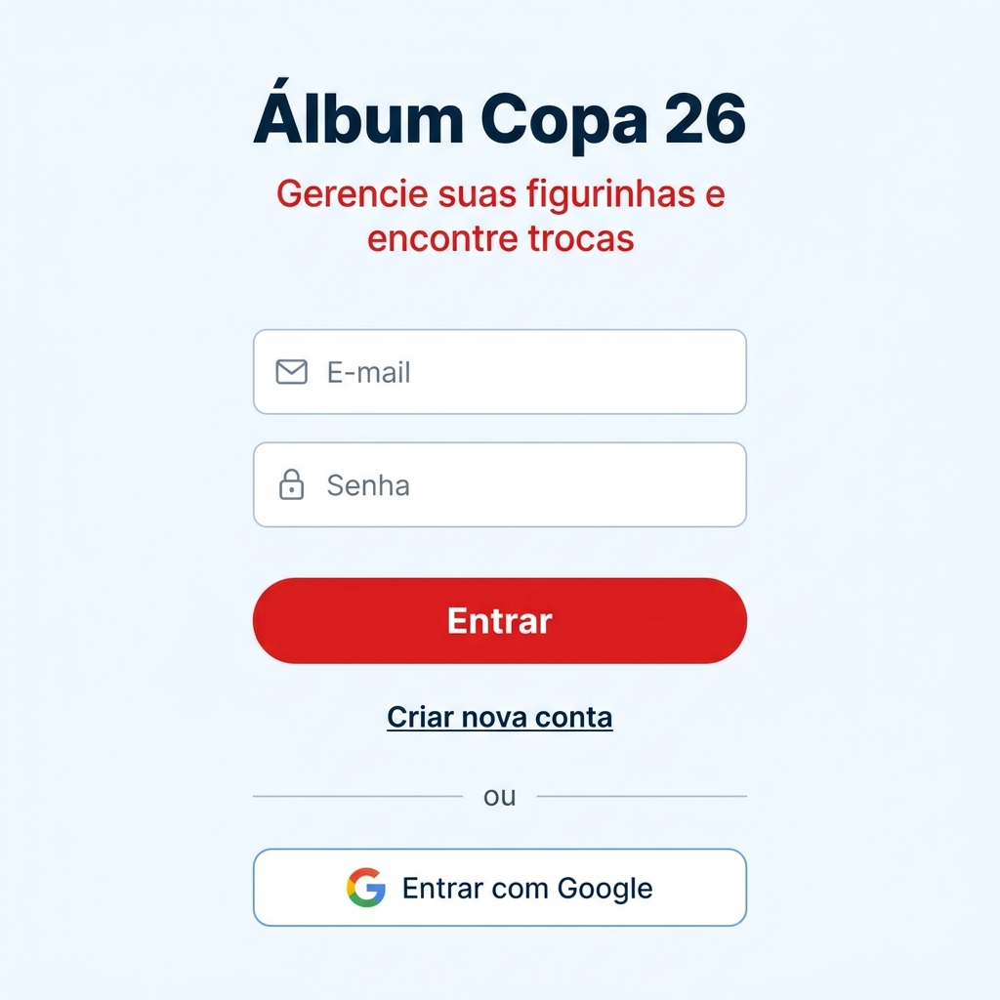
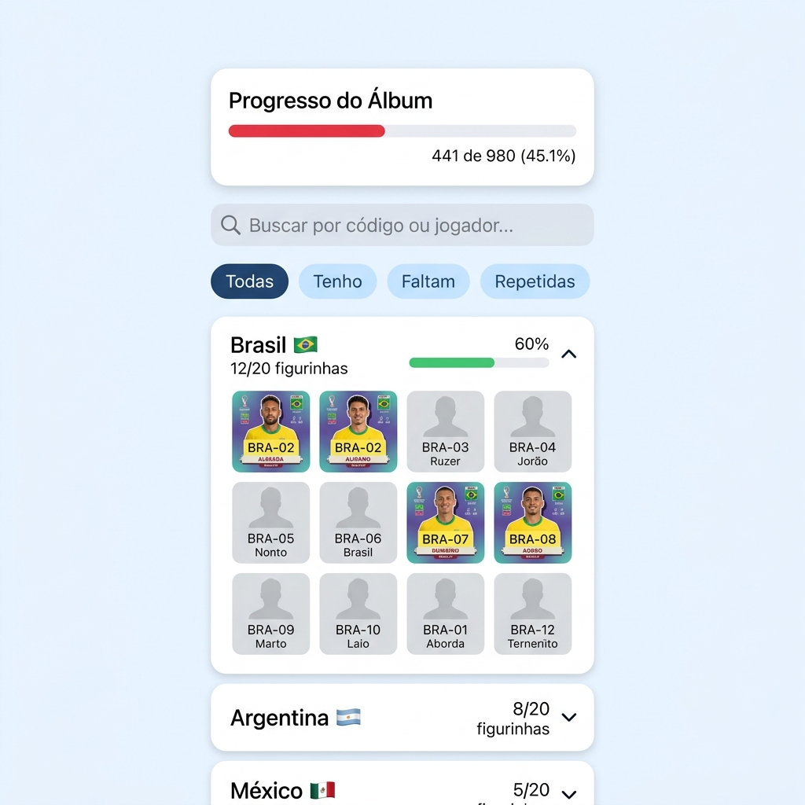
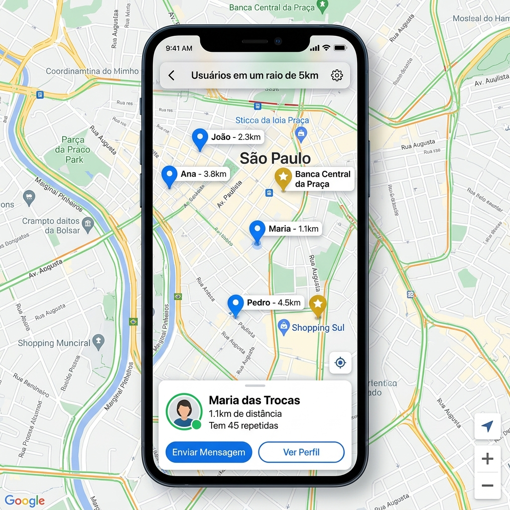
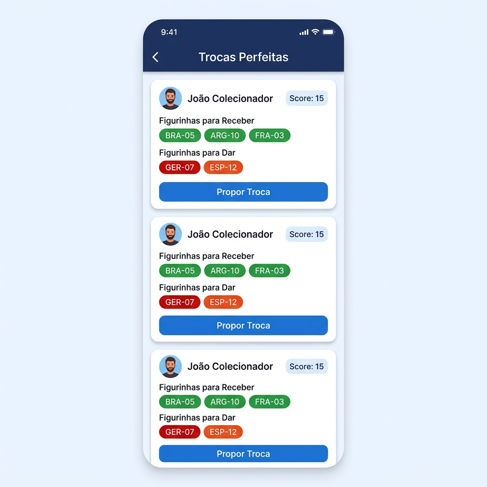
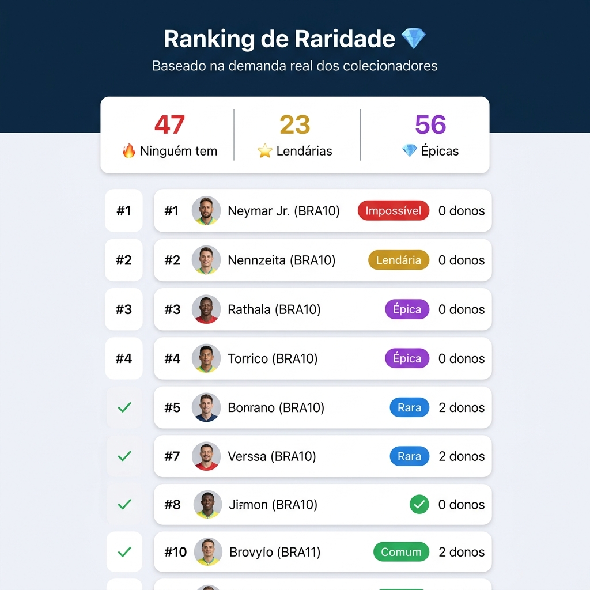
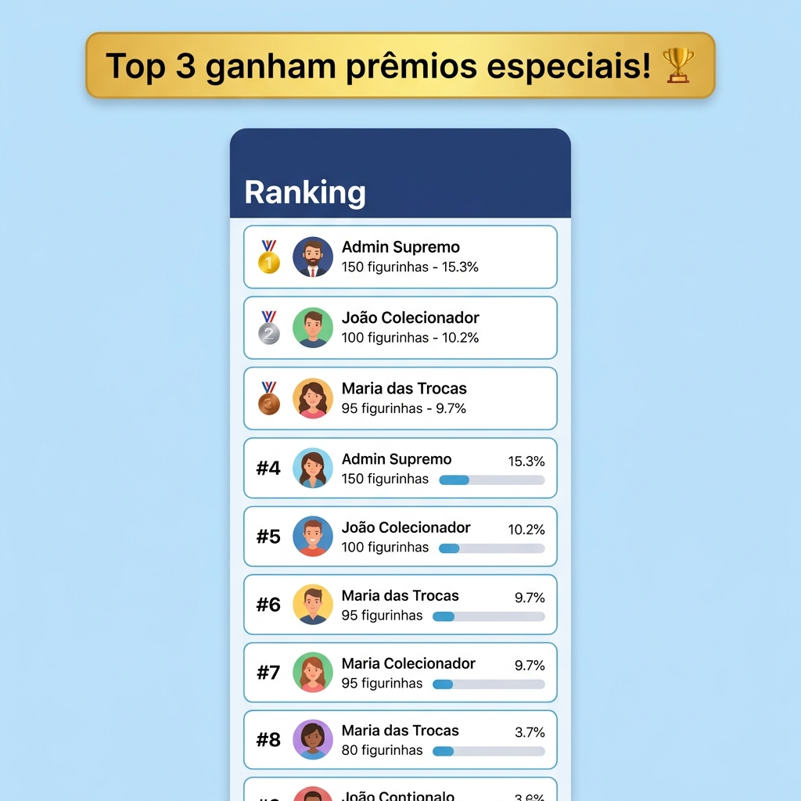
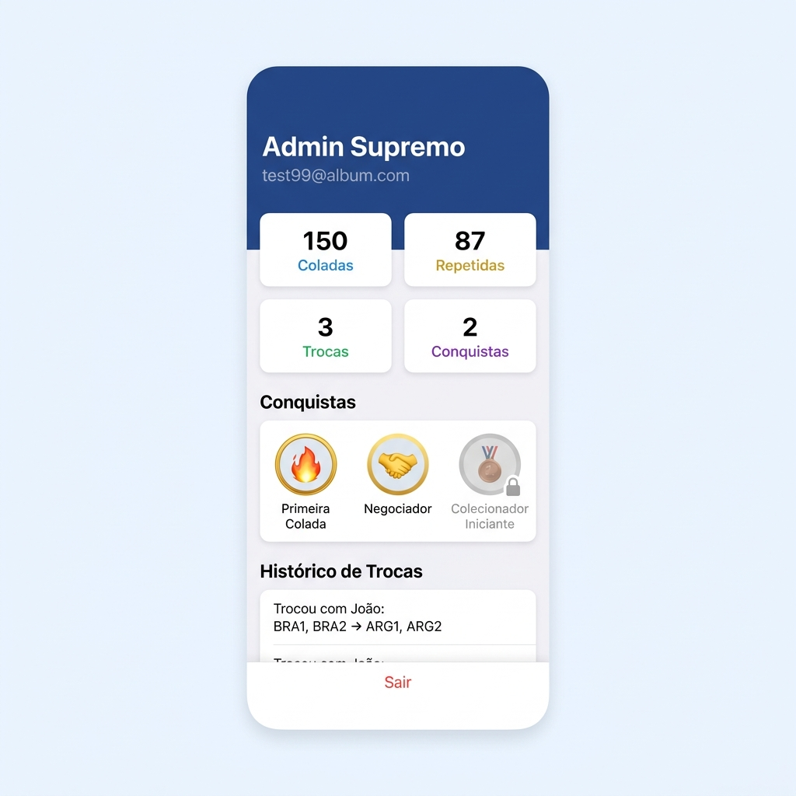
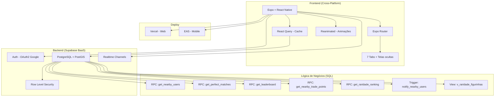

# 🏆 Álbum de Figurinhas da Copa 2026 — Digital & Interativo

<p align="center">
  
  
  
  
  
  
</p>

<p align="center">
  <b>🔗 Web App:</b> <a href="#"><!-- Cole o link da Vercel aqui -->[Link da Vercel]</a> &nbsp;|&nbsp;
  <b>📝 Artigo:</b> <a href="#"><!-- Cole o link do Medium aqui -->[Artigo no Medium]</a> &nbsp;|&nbsp;
  <b>💼 LinkedIn:</b> <a href="#"><!-- Cole o link do post aqui -->[Post no LinkedIn]</a>
</p>

---

Um aplicativo **cross-platform** (iOS, Android e Web) que digitaliza a experiência de colecionar e trocar figurinhas da Copa do Mundo 2026. Mais do que um simples checklist, ele funciona como um **"Tinder de Figurinhas"**: conecta colecionadores próximos geograficamente por meio de algoritmos de match que identificam interesses de troca mútuos — tudo processado diretamente no banco de dados via SQL avançado.

## 📸 Screenshots

<p align="center">
  
  
  
  
</p>
<p align="center">
  
  
  
</p>
<p align="center"><i>Da esquerda para a direita: Login, Álbum (accordion por seleção), Mapa de Trocas, Match Inteligente, Raridade Dinâmica, Ranking e Perfil.</i></p>

## 🧪 Conta Demo (Teste)

Quer experimentar sem criar uma conta? Use as credenciais abaixo:

| Campo | Valor |
|-------|-------|
| **E-mail** | `demo@albumcopa.com` |
| **Senha** | `demo2026` |

> A conta demo vem pré-populada com **150 figurinhas coladas**, figurinhas repetidas para teste de matches, histórico de trocas e conquistas desbloqueadas. Os dados são resetados periodicamente.

## 🚀 Funcionalidades

| Feature | Descrição |
|---------|-----------|
| 📊 **Álbum Visual** | Grid interativo com 980 figurinhas organizadas por seleção (accordion com bandeiras), busca por nome/código e filtros (Tenho, Faltam, Repetidas). Barra de progresso global e confetti ao atingir milestones (25%, 50%, 75%, 100%). |
| 💎 **Raridade Dinâmica** | Tela dedicada que classifica todas as figurinhas em 5 níveis (Comum → Lendária) com base na escassez **real** da base de dados — não em dados fixos. |
| 🌍 **Mapa de Trocas** | Mapa interativo com geolocalização (PostGIS) mostrando colecionadores e pontos de troca oficiais em um raio de 5km. |
| 🤝 **Match Inteligente** | Algoritmo SQL de cross-matching: encontra parceiros que **têm** o que você precisa **e** precisam do que você tem repetido. Score de compatibilidade. |
| 💬 **Chat Realtime** | Mensagens instantâneas via Supabase Channels para combinar o local do encontro. Sugestão automática do ponto de troca mais próximo. |
| 🏆 **Ranking & Gamificação** | Leaderboard dos maiores colecionadores com porcentagem de conclusão. Sistema de conquistas desbloqueáveis (Primeira Colada, Negociador, Lenda da Copa). |
| 📷 **Scanner** | Câmera integrada para leitura de figurinhas (simulação para demo). |
| 🔔 **Radar Push** | Trigger SQL que detecta quando alguém próximo adiciona uma figurinha que você precisa e dispara notificação. |
| 🔐 **Login Google** | Autenticação OAuth2 via Google (nativo + web) com Supabase Auth. |

## 🏗️ Arquitetura



### Stack Tecnológico

| Camada | Tecnologia | Papel |
|--------|-----------|-------|
| **Frontend** | Expo SDK 56, React Native 0.85, TypeScript | App cross-platform (iOS, Android, Web) |
| **Navegação** | Expo Router (file-based routing) | 7 tabs + rotas de auth e modais |
| **Estado** | React Query (TanStack) | Cache, invalidação, refetch automático |
| **Animações** | React Native Reanimated | Confetti, skeleton loading, transições |
| **Listas** | FlashList (Shopify) | Renderização otimizada de 980+ itens |
| **Backend** | Supabase (BaaS) | Auth, Database, Realtime, Storage |
| **Banco** | PostgreSQL + PostGIS | Relacional + queries geoespaciais |
| **Lógica** | 5 RPCs + 1 Trigger + 1 View (PL/pgSQL) | Matches, ranking, geo, raridade, push |
| **Segurança** | Row Level Security (RLS) | Isolamento de dados por usuário |
| **Deploy Web** | Vercel | CI/CD com export estático do Expo |

## 📁 Estrutura do Projeto

```
AlbumFigurinhasCopa/
├── app/
│   ├── (auth)/                  # Telas de autenticação
│   │   ├── login.tsx            # Login email/senha + Google OAuth
│   │   ├── register.tsx         # Cadastro de novo usuário
│   │   └── onboarding.tsx       # Onboarding com slides e paginação
│   ├── (tabs)/                  # Navegação principal (Bottom Tabs)
│   │   ├── album/index.tsx      # Grid visual com AccordionTeam por seleção
│   │   ├── album/scanner.tsx    # Scanner de câmera
│   │   ├── mapa/index.tsx       # Mapa geoespacial (PostGIS)
│   │   ├── match/index.tsx      # Cross-matching de trocas
│   │   ├── ranking/index.tsx    # Leaderboard dos colecionadores
│   │   ├── raridade/index.tsx   # Ranking de raridade dinâmica
│   │   ├── perfil/index.tsx     # Perfil, conquistas e histórico
│   │   └── chat/               # Chat realtime por match
│   ├── _layout.tsx              # Root layout (QueryClient, StatusBar)
│   └── index.tsx                # Entry point (auth guard + onboarding)
├── components/
│   ├── AccordionTeam.tsx        # Seleção recolhível com bandeira e progresso
│   ├── StickerDetailModal.tsx   # Modal de detalhes da figurinha
│   ├── ConfettiOverlay.tsx      # Animação de confetti nos milestones
│   ├── SkeletonCard.tsx         # Placeholder animado de carregamento
│   └── GlobalErrorBoundary.tsx  # Tratamento de erros global
├── hooks/                       # 11 custom hooks (React Query + Supabase)
├── lib/supabase.ts              # Client Supabase com SecureStore adapter
├── data/catalogo-figurinhas.json  # 980 figurinhas (48 seleções + FIFA)
├── database_schema.sql          # Schema completo (11 tabelas + RLS)
├── rpc_*.sql                    # 5 funções RPC em PL/pgSQL
├── scripts/generate_catalog.js  # Gerador do catálogo de figurinhas
├── seed_admin.js                # Script de seed com mock data analítico
└── vercel.json                  # Configuração de deploy Vercel
```

## 🧠 Destaques de Engenharia

### Raridade Dinâmica (SQL)
A raridade de cada figurinha é calculada em tempo real com base na proporção de donos vs. total de usuários — não é cadastrada manualmente:

```sql
-- View: v_raridade_figurinhas (simplificado)
CASE 
  WHEN fc.e_brilhante AND SUM(inv.quantidade_repetida) = 0 THEN 'Lendária ⭐'
  WHEN SUM(inv.quantidade_repetida) = 0 THEN 'Ultra Rara 🔥'
  WHEN SUM(inv.quantidade_repetida) < AVG(quantidade_repetida) * 0.3 THEN 'Rara 💎'
  ELSE 'Comum 🟢'
END AS raridade_dinamica
```

### Cross-Matching de Trocas (SQL)
O algoritmo que encontra "trocas perfeitas" roda inteiramente no PostgreSQL via RPC:

```sql
-- RPC: get_perfect_matches() — Encontra parceiros com interesses mútuos
WITH minhas_repetidas AS (
  SELECT codigo_figurinha FROM inventario 
  WHERE id_usuario = auth.uid() AND quantidade_repetida > 0
),
minhas_faltantes AS (
  SELECT codigo_figurinha FROM inventario 
  WHERE id_usuario = auth.uid() AND quantidade_colada = 0
)
-- JOIN cruzado: quem tem o que preciso E precisa do que tenho
SELECT parceiro_id, score_match 
FROM parceiros_com_o_que_preciso
INNER JOIN parceiros_que_precisam_do_que_tenho ...
ORDER BY score_match DESC;
```

### Geolocalização com PostGIS
Busca em tempo real de colecionadores em um raio geográfico usando geometria espacial:

```sql
-- RPC: get_nearby_users() — Busca com ST_DWithin (índice GIST)
SELECT p.id, p.nome, 
  ST_Distance(p.posicao, ST_SetSRID(ST_MakePoint(user_lng, user_lat), 4326)) AS distancia_metros
FROM profiles p
WHERE p.id != auth.uid()
  AND ST_DWithin(p.posicao, ST_SetSRID(ST_MakePoint(user_lng, user_lat), 4326), radius_meters)
ORDER BY distancia_metros ASC;
```

## ⚙️ Como Rodar Localmente

### Pré-requisitos
- **Node.js** (v18+)
- **Conta no [Supabase](https://supabase.com/)** (Free Tier é suficiente)
- **Git**

### Instalação

```bash
# 1. Clone o repositório
git clone https://github.com/kenyamashida/FigurinhasDaCopa.git
cd FigurinhasDaCopa

# 2. Instale as dependências
npm install

# 3. Configure as variáveis de ambiente
# Copie o .env.example e preencha com suas chaves do Supabase
cp .env.example .env

# 4. Execute os scripts SQL no Supabase Dashboard (SQL Editor):
#    - database_schema.sql  (tabelas + RLS)
#    - rpc_geo.sql           (busca geográfica)
#    - rpc_match.sql         (cross-matching)
#    - rpc_ranking.sql       (leaderboard)
#    - rpc_trade_points.sql  (pontos de troca)
#    - rpc_radar_push.sql    (notificações push)

# 5. Popule o banco com dados de teste
node seed_admin.js

# 6. Inicie o projeto
npm run web     # Versão Web (Vercel preview)
npm run start   # Expo DevTools (iOS/Android)
```

### Variáveis de Ambiente

```env
EXPO_PUBLIC_SUPABASE_URL=https://seu-projeto.supabase.co
EXPO_PUBLIC_SUPABASE_ANON_KEY=sua_anon_key_aqui
```

## 🌐 Deploy

### Web (Vercel)
1. Importe o repositório na [Vercel](https://vercel.com/).
2. Adicione as variáveis de ambiente no painel.
3. **Build Command:** `npx expo export -p web`
4. **Output Directory:** `dist`

### Mobile (EAS Build)
```bash
npx eas build --platform android
npx eas build --platform ios
```

## 📊 Números do Projeto

| Métrica | Valor |
|---------|-------|
| Figurinhas no catálogo | **980** |
| Seleções (Copa 2026) | **48** (12 grupos × 4) |
| Figurinhas FIFA especiais | **20** |
| Tabelas no banco | **11** (+ 1 view + 5 RPCs + 2 triggers) |
| Custom Hooks | **11** |
| Componentes reutilizáveis | **5** |
| Telas do app | **13** |
| Commits | **13** |

## 🤖 Metodologia e Uso de IA (Declaração Acadêmica)

Este projeto foi desenvolvido utilizando a Inteligência Artificial **Gemini (Google DeepMind)** como ferramenta de **Pair Programming** e **Arquitetura de Software**. A IA auxiliou ativamente em:

- **Modelagem de dados relacional:** Desenho das 11 tabelas com constraints, triggers e políticas de Row Level Security (RLS).
- **Queries avançadas em PL/pgSQL:** Formulação das 5 RPCs (geolocalização com PostGIS, cross-matching de inventários, ranking dinâmico de raridade).
- **Arquitetura frontend:** Estruturação do Expo Router com file-based routing, custom hooks com React Query e padrões de cache.
- **Mock Data para Analytics:** Scripts de geração massiva de dados fictícios para validar os algoritmos de match e raridade sob estresse.
- **Code Review e Auditoria:** Identificação e correção de memory leaks, imports quebrados, guards de plataforma e problemas de segurança.

**Citação (Padrão ABNT):**
> GOOGLE. *Gemini*. Versão 3.1 Pro. Modelo de Linguagem de Larga Escala (LLM). Mountain View: Google DeepMind, 2026. Disponível em: <https://gemini.google.com/>. Acesso em: 17 jun. 2026.

## 📄 Licença

Distribuído sob a licença MIT. Veja [LICENSE](LICENSE) para mais detalhes.

---

<p align="center">
  Feito com ⚽ por <a href="https://github.com/kenyamashida">Ken Yamashida</a>
</p>
